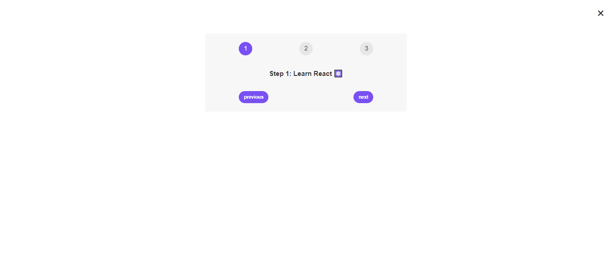

# 🚀 Steps Project

A small project called **Steps** built using **React**! It demonstrates core React concepts like state management and conditional rendering. 🎉

## 📸 Screenshot



## 🛠️ Concepts Implemented

- **useState** Hook for managing state 🎛️
  - The `useState` hook is used to keep track of the current step and toggle the visibility of the component.
- **Conditional Rendering** 🌐
  - Dynamically show or hide parts of the UI based on the current step using React's built-in conditional rendering.
- **Fragment** Usage ✨
  - We wrap the components inside `<Fragment>` to avoid unnecessary extra nodes in the DOM, which is a cleaner approach for grouping elements.

## 🎯 Functionality

- **Step Navigation** ⏭️
  - Navigate through different steps (Learn React, Apply for Jobs, and Invest Income) using the **Next** and **Previous** buttons.
- **Close/Open Toggle** 🚪
  - The steps section can be toggled open or closed using the close button (`X`).

## 🔍 Breakdown of the Code

1. **useState Hooks:**

   - `step` stores the current step number and `setStep` updates it.
   - `isOpen` controls the visibility of the steps component.

2. **Button Logic:**

   - **Previous Button** ➡️ Decreases the step number if it’s greater than 1.
   - **Next Button** ➡️ Increases the step number if it’s less than 3.
   - **Close Button** ➡️ Toggles the display of the steps section.

3. **Messages and Display:**
   - The messages change according to the step. For example, Step 1 shows "Learn React ⚛️," Step 2 shows "Apply for jobs 💼," and Step 3 displays "Invest your new income 🤑."

## 🚀 Getting Started

1. Clone this repository:
   ```bash
   git clone https://github.com/your-username/steps-project.git
   ```
1. Install dependencies:
   ```bash
   npm install
   ```
1. Start the project:
   ```bash
   npm start
   ```

## 👨‍💻 Technologies Used

- React ⚛️
- Javascript 🟨
- HTML 📝
- CSS 🎨

## 💡 Future Improvements

- 🎨 Improve styling and animations for better user experience.
- 📝 Add more dynamic steps and custom messages.
